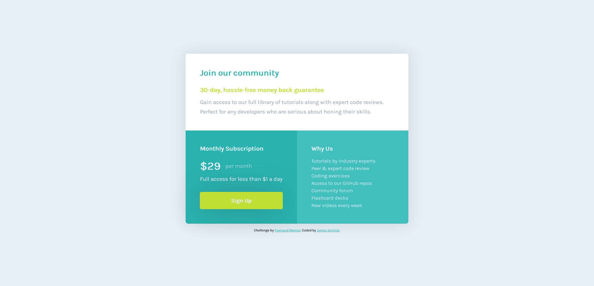

# Frontend Mentor - Single price grid component solution

This is a solution to the [Single price grid component challenge on Frontend Mentor](https://www.frontendmentor.io/challenges/single-price-grid-component-5ce41129d0ff452fec5abbbc). Frontend Mentor challenges help you improve your coding skills by building realistic projects. 

## Table of contents

- [Overview](#overview)
  - [The challenge](#the-challenge)
  - [Screenshot](#screenshot)
  - [Links](#links)
- [My process](#my-process)
  - [Built with](#built-with)
  - [What I learned](#what-i-learned)
  - [Continued development](#continued-development)
  - [Useful resources](#useful-resources)
- [Author](#author)
- [Acknowledgments](#acknowledgments)

## Overview

### The challenge

Users should be able to:

- View the optimal layout for the component depending on their device's screen size
- See a hover state on desktop for the Sign Up call-to-action

### Screenshot

### Links

- Solution URL: [GitHub](https://github.com/jgreilick/single-price-grid-component)
- Live Site URL: [GitHub Pages](https://jgreilick.github.io/single-price-grid-component)

## My process

### Built with

- CSS custom properties
- Flexbox
- CSS Grid
- Mobile-first workflow

### What I learned

This was the first time I created a layout from a design.  I learned the beginnings of a workflow from the approach suggested in the Frontend 
Mentor README.  I was able to apply some basic CSS concepts that I have learned, building more comfortability with CSS in general.  I also touched 
for the first time on media queries, hsl colors, and responsive design without the use of Bootstrap.

### Continued development

For now, my focus is on building a strong foundation in the fundamentals of HTML, CSS, and Javascript.  I have much to learn, and hope to build
familiarity and comfortability with the basics.  I am also eager to learn and adopt best practices for writing clean and maintainable code.
I look forward to viewing other solutions for this challenge as I am sure to find more efficient and cleaner practices that I can learn from and
apply to my next challenge.

### Useful resources

- [MDN Web Docs](https://developer.mozilla.org) - I am still a novice, learning the basics of front end development. This is my go-to resource.

## Author

- James Greilick - No website, just a fireman learning web development :)

## Acknowledgments

I would like to thank FrontEnd Mentor.  This is a great platform and I look forward to completing more challenges!
